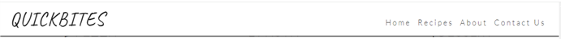
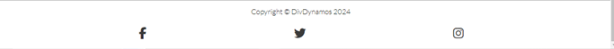
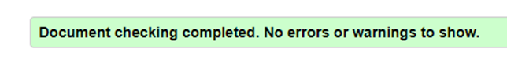
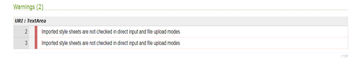

<h1>QuickBites</h1>
<h3>project overview</h3>

QuickBites is for anyone who is passionate about bringing the delicious Flavors of Italy to their kitchen with easy-to-follow recipes that take under 30 minutes to prepare. Our recipes are designed to fit into your busy schedule without compromising on taste.

 <a href="https://saramehlis.github.io/QuickBites/" rel=nofollow>Live project Here</a> 

<!--images from different screen sizes-->

<h3>Index:</h3>
<ul>
  <li>User Experience (UX)</li>
  <li>Features</li>
  <li>Desidn</li>
  <li>Technologies Used</li>
  <li>Testing</li>
  <li>Deployment</li>
  <li>Bugs</li>
  <li>Future features</li>
  <li>Credit</li>
</ul>

<h3><ins>User Experience-UX</ins></h3>
AS a user, I want to, 
  <ul>
<li>	easily understand the main purpose of the site and learn more about the organisation to have clarity.</li>
<li>	be able to easily navigate throughout the site to find content.</li>
<li>	be able to easily find contact information section to give feedback or ask questions.</li>
<li>  get recipes’ instructions, So that I may make informed choices.</li>
<li>	see pictures, So that I can see how the recipes will be looked like once cooked.</li>
<li>	See the site work on all of my devices, So that I have a consistent experience.</li>
<li>  Have an interactive community section, So that I can engage with fellow food enthusiasts, share my cooking experiences, and ask for advice.</li>
<li>  subscribe to a newsletter, So that I can receive regular updates on new recipes, cooking trends.</li>
    </ul>

<h3><ins>Features</ins></h3>
<ul>
  <li>Navigation bar:</li>
  

  The navigation bar has a consistent look in all four pages of the website supporting easy navigation. It includes a simple Logo, Home page, Recipes, About and Contact us links and is responsive on multiple screen sizes. On small screens (e.g. mobile devices) the Home, Recipes, About and Contact us links move to under the Logo.
 <li>The footer</li>
 

  The footer is featured on all four pages and is identical on each page making it easy to use. It contains three links to social media sites associated with the website encouraging the user to keep connected. The links will open in a new tab to allow easy navigation for the user. The company can use these sites to promote the brand and keep customers interested. 
  <li>Images</li>
  
  The Images have been chosen to reflect the aim of the site (the Italian flag and famoue food ingredients).
Each type of food section had main image to help keep the site clear and easy to use.
  <li>Recipes section in the home page</li>
  This part has been split into three parts each part has a clickable image that open in the recipes page to avoid crowdiness in home page for good user experience.
  <li>Recipes page</li>
  Contains a list of the recipes that could be cooked in less than 30 minutes.
  <li>About Page</li>
  This page provide description to users to provide clarity.
  <li>Contact us page:</li>
  The Contact Us section allows the user to send a message/give feedback to the company. The user is asked to provide their name and email address when sending a message.
  
</ul>

<h3><ins>Design</ins></h3>
<ul>

<li>Balsamiq wireframe</li>
Balsamiq was used to create a low-fidelity wireframe for design purposes.

<li>Font</li>
Google Fonts were used to import Lato and Oswald fonts into styles.css. These were chosen as they work well together and have a simple feel that is easy to read.

<li>Color scheme</li>
Black and white colors were kept simple for readability and to minimise distraction.Green and red accents were added to reflect the Italian theme.

</ul>

<h3><ins>Technology Used</ins></h3>
<ul>
  <li>Languages used:</li>
  Html5 and Css3.

  <li>Websites:</li>
  <ul>
  <li>  GitHub is used as the respository for the projects code also used to create issues and Kanban board.</li>
  <li>  GitPod is used as a workspace.</li>
  <li>  Google font is used to import fonts.</li>
  <li>  Fontawsome is used to add icons for UX purposes.</li>
  <li>  Favicon.io is used to create favicon.</li>
  <li>  Contrast Checker is used for accessibility and readability.</li>
 </ul> 

</ul>

<h3><ins>Testing</ins></h3>

  Validator for Html is Nu Html Checker.
  <ul>
    <li>Result for home page, recipes page, about page and contact us page:</li>
    

  </ul>

  Validator for Css is w3c css.
  

<h3><ins>Deployment:</ins></h3>
This site was deployed by completing the following steps:
<ol>
  <li>In the GitHub repository, navigate to the Settings tab, then choose Pages from the left hand menu</li>
  <li>From the source section drop-down menu, select the Main Branch</li>
  <li>Once the mainr branch has been selected, folder is set to root click save. Go back to the code tab, wait for couple of minutes for the build to finish.</li>
  <li>refresh your repository, Go to setting, choose environment , then github pages, the link will be there.</li>
</ol>

The live link can be found here: https://saramehlis.github.io/QuickBites/index.html

The team used Forking by following the steps:
<ol>
  <li>Open GitHub</li>
  <li>Find the 'Fork' button at the top right of the page</li>
  <li>Once you click the button the fork will be in your repository</li>
</ol>

<h3><ins>Future features</ins></h3>
Features which could be implemented in the future
<ul>
  <li>Expand our recipes data base.</li>
  <li>Add images to every recipes so user know how the recipes will be looked like once cooked.</li>
  <li>Add signup section, so users can have weekly newsletters.</li>
  <li>Add videos to the difficult recipes to make the instructions clear.</li>
</ul>

